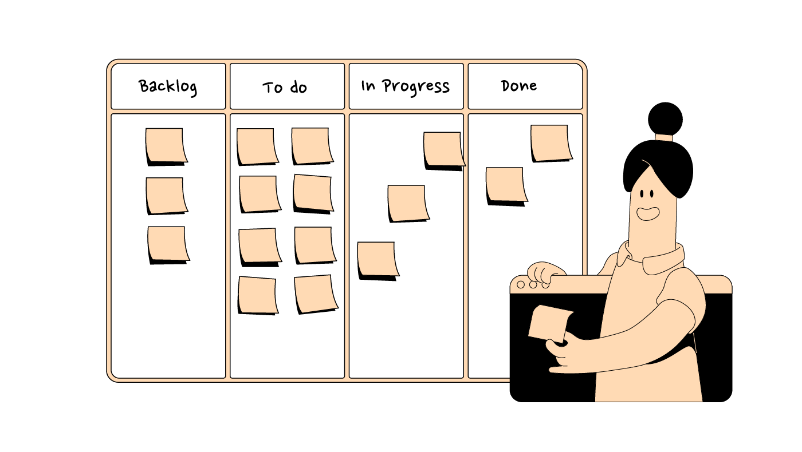

# Web app KanbanBoard 

### Kanban board on **html**, **css** and **js**.
This kanban is classically designed and easy to understand and use, which is very important for such applications.
Of course, it is very unfinished, but still it can already be used for non-long-term planning.

